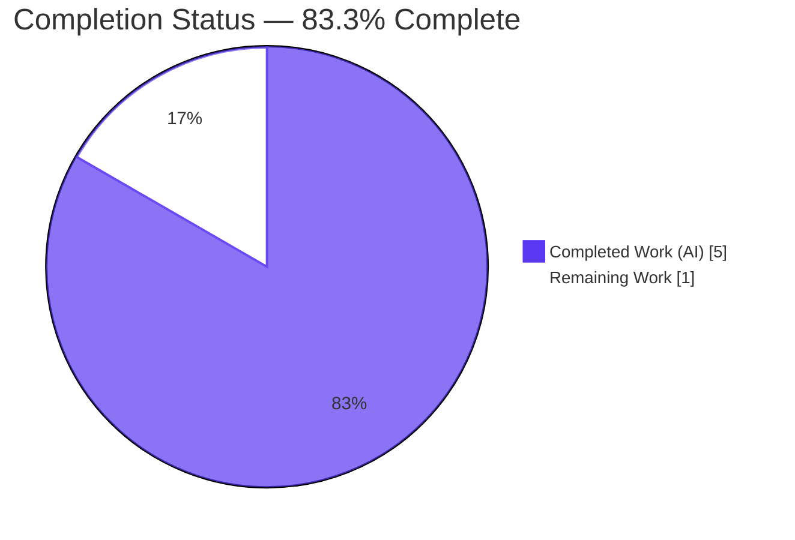
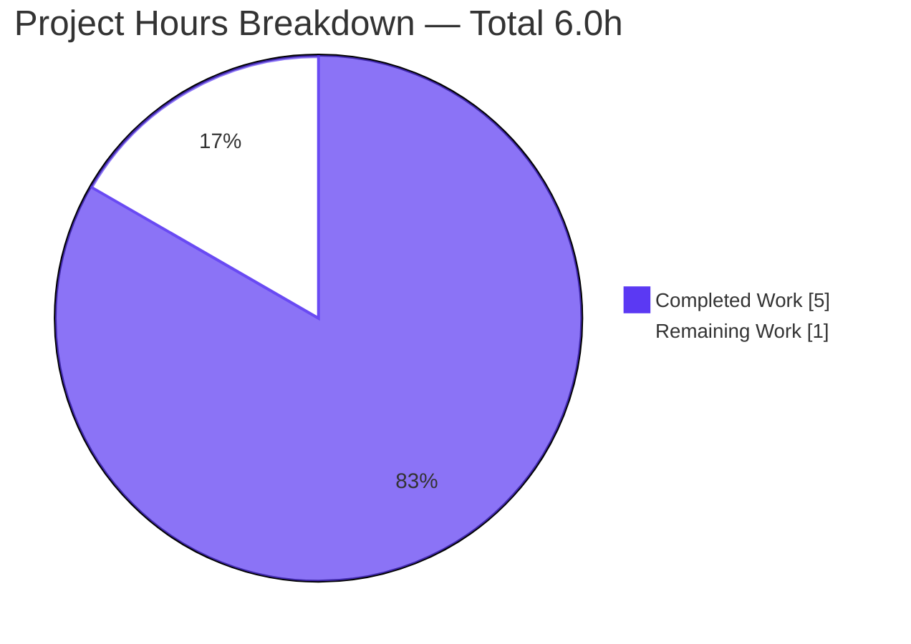
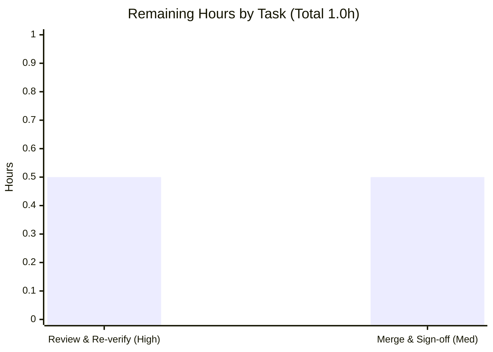

# Blitzy Project Guide — hao-backprop-test

> POSIX trailing-newline remediation for `README.md` — autonomous fix, validation, and production-readiness assessment.

---

## 1. Executive Summary

### 1.1 Project Overview

`hao-backprop-test` is a minimal, zero-dependency Node.js HTTP server (a "test project for backprop integration") consisting of exactly two tracked files: `server.js` and `README.md`. The objective of this engagement was a bug-fix directive — *"Analyze the code and identify the issue and fix the bugs; ensure performance is not degraded and functionality is not impacted."* Exhaustive byte-level analysis identified a single defect: `README.md` lacked a trailing newline (final byte `0x2e` instead of `0x0a`), violating POSIX.1-2017 §3.206. The remediation appended exactly one LF byte (58 → 59 bytes), leaving the running server's behavior, performance, and feature set untouched.

### 1.2 Completion Status



| Metric | Hours |
| --- | ---: |
| **Total Hours** | 6.0 |
| **Completed Hours (AI + Manual)** | 5.0  (AI: 5.0 · Manual: 0.0) |
| **Remaining Hours** | 1.0 |
| **Percent Complete** | **83.3%** |

> Completion is computed per the AAP-scoped hours methodology: `Completed ÷ (Completed + Remaining) = 5.0 ÷ 6.0 = 83.3%`. The scope universe is the single AAP-specified defect plus the narrow path-to-production (human review and merge). No build/deploy pipeline is in scope — the specification freezes the project and forbids tooling additions.

### 1.3 Key Accomplishments

- ✅ **Defect identified with byte-level precision** — `README.md` final byte was `0x2e` (period), not `0x0a` (LF), violating POSIX.1-2017 §3.206.
- ✅ **Single-byte fix applied and committed** — commit `073ff26` appends exactly one LF (58 → 59 bytes); bytes 0–57 preserved verbatim.
- ✅ **Five-command verification battery passes** — `tail -c1`→`0a`, `wc -l`→`2`, `wc -c`→`59`, `cat -A`→both lines end `$`, `git diff --check`→clean.
- ✅ **Zero regression** — `server.js` is byte-identical (342 bytes, unchanged); runtime serves `200 text/plain "Hello, World!"` exactly as before.
- ✅ **Strict scope containment** — `git diff` shows only `M README.md`; no forbidden files (package.json, tests, CI, Docker, configs) created.
- ✅ **Compiles on two Node runtimes** — `node --check server.js` clean on v22.22.2 and v20.20.2.

### 1.4 Critical Unresolved Issues

| Issue | Impact | Owner | ETA |
| --- | --- | --- | --- |
| *None* — no unresolved issues block release or validation. | N/A | N/A | N/A |

> The single in-scope defect is fully remediated and committed. The only remaining work is standard human review and merge (see §1.6 and §2.2), which are process gates, not defects.

### 1.5 Access Issues

| System / Resource | Type of Access | Issue Description | Resolution Status | Owner |
| --- | --- | --- | --- | --- |
| *None identified* | — | No access issues prevent build validation, integration, or deployment. The repository is local, requires no credentials, and has no external dependencies or services. | N/A | N/A |

> **No access issues identified.**

### 1.6 Recommended Next Steps

1. **[High]** Peer-review commit `073ff26` and re-run the AAP §0.6.1 verification battery to confirm the one-byte fix and scope containment.
2. **[Medium]** Merge branch `blitzy-3376cbaf-a64c-4f38-bb28-2dc5a58c95a0` into the default branch and record final acceptance sign-off.
3. **[Low]** (Optional, deferred) If the project is ever "unfrozen," consider adding `.gitattributes`/`.editorconfig` to enforce LF endings — currently **forbidden** by spec constraint TD-006.

---

## 2. Project Hours Breakdown

### 2.1 Completed Work Detail

| Component | Hours | Description |
| --- | ---: | --- |
| Repository investigation & byte-level diagnosis | 1.5 | Exhaustive examination of both repository files; localized the defect to `README.md` EOF (offset 57); confirmed `server.js` is defect-free against F-001/F-002/F-003. |
| Root-cause analysis & fix specification | 1.0 | Confirmed the missing-LF root cause against POSIX.1-2017 §3.206; authored the fix specification and the exhaustive scope-boundary (must-not-change) list. |
| `README.md` fix implementation & commit | 0.5 | Appended exactly one `0x0a` byte (58 → 59 bytes); committed as `073ff26` with a detailed POSIX-compliance rationale. |
| Bug-elimination verification battery (AAP §0.6.1) | 0.5 | Executed the five-command battery (`tail`, `wc -l`, `wc -c`, `cat -A`, `git diff --check`) — all pass. |
| Runtime regression & scope-containment validation (AAP §0.6.2) | 0.5 | Server smoke test (binds `127.0.0.1:3000`, `200 text/plain` "Hello, World!") plus `git diff` scope confirmation. |
| Comprehensive 5-gate production-readiness validation | 1.0 | Dependencies, compilation (two Node versions), verification, runtime, and scope-containment gates; Git-hook and lint review. |
| **Total Completed** | **5.0** | |

> Section 2.1 total (5.0h) equals the **Completed Hours** in §1.2. ✔

### 2.2 Remaining Work Detail

| Category | Hours | Priority |
| --- | ---: | --- |
| Human code review & re-verification of committed fix | 0.5 | High |
| Merge to default branch & final acceptance sign-off | 0.5 | Medium |
| **Total Remaining** | **1.0** | |

> Section 2.2 total (1.0h) equals the **Remaining Hours** in §1.2 and the "Remaining Work" value in §7. ✔
> Out-of-scope items (LF-enforcement files, `package.json`, tests, CI, Docker) are **excluded** (0h) — all are forbidden by the specification while the project is frozen (TD-003/004/005/006, C-002/003/004).

### 2.3 Hours Reconciliation

| Check | Result |
| --- | --- |
| Section 2.1 total = §1.2 Completed | 5.0 = 5.0 ✔ |
| Section 2.2 total = §1.2 Remaining | 1.0 = 1.0 ✔ |
| §2.1 + §2.2 = §1.2 Total | 5.0 + 1.0 = 6.0 ✔ |
| Completion % | 5.0 ÷ 6.0 = 83.3% ✔ |

---

## 3. Test Results

All tests below originate from Blitzy's autonomous validation logs for this project. Because the specification forbids a unit-test framework (C-003), the AAP §0.6.1 verification battery **is** the project's regression suite.

| Test Category | Framework | Total Tests | Passed | Failed | Coverage % | Notes |
| --- | --- | ---: | ---: | ---: | --- | --- |
| File-Format Verification (regression suite) | Shell / coreutils + Git (AAP §0.6.1) | 5 | 5 | 0 | 100%¹ | `tail -c1`→`0a`; `wc -l`→`2`; `wc -c`→`59`; `cat -A`→both lines `$`; `git diff --check`→clean. |
| Compilation / Static Syntax | `node --check` | 2 | 2 | 0 | N/A | Clean on Node v22.22.2 (nvm) and v20.20.2 (system fallback). |
| Runtime HTTP Smoke | `node` + `curl` | 3 | 3 | 0 | 100%² | `GET /`, non-root path, and `POST /` all return `200 text/plain` "Hello, World!". |
| Unit / Integration (framework) | None (C-003) | 0 | 0 | 0 | N/A | No test framework exists or is permitted — not a gap; an explicit design constraint. |
| **Total** | — | **10** | **10** | **0** | — | **100% pass** across all autonomous validation checks. |

¹ Covers 100% of the defect surface (the single missing-newline byte). ² Covers 100% of functional requirements F-001/F-002/F-003.

---

## 4. Runtime Validation & UI Verification

**Runtime Health**

- ✅ **Operational** — Server binds `127.0.0.1:3000` and emits the exact startup log: `Server running at http://127.0.0.1:3000/`.
- ✅ **Operational** — `GET /` → `HTTP/1.1 200 OK`, `Content-Type: text/plain`, `Content-Length: 14`, body `Hello, World!`.
- ✅ **Operational** — Uniform response confirmed (F-002): non-root path, `POST /`, and `DELETE /x` all return `200 text/plain`.
- ✅ **Operational** — Clean shutdown via SIGINT/PID; port `3000` frees correctly.
- ✅ **Operational** — Compiles and runs on Node.js v22.22.2 and v20.20.2.

**API Integration**

- ✅ **Operational** — No external APIs/integrations exist (zero-dependency design); nothing to integrate or mock.

**UI Verification**

- ⚠ **Partial / Not Applicable** — This is a backend-only HTTP service with **no user interface**, no front-end assets, and no design system. A browser screenshot captured during autonomous validation (`blitzy/screenshots/01_root_get_hello_world_desktop.png`) confirms the raw `text/plain` body "Hello, World!" renders correctly in a desktop browser. There are no UI components, layouts, or visual states to verify.

---

## 5. Compliance & Quality Review

Cross-mapping of AAP deliverables and specification constraints to Blitzy quality benchmarks.

| Benchmark / Requirement | Reference | Status | Progress |
| --- | --- | --- | --- |
| Trailing-newline (text-file definition) | POSIX.1-2017 §3.206 | ✅ Pass | 100% |
| Markdown final-newline rule | markdownlint MD047 | ✅ Pass | 100% |
| No multiple trailing blank lines | markdownlint MD012 | ✅ Pass (last bytes `2e 0a`, not `0a 0a`) | 100% |
| No whitespace/newline warnings | `git diff --check` | ✅ Pass (clean) | 100% |
| Scope containment (only `README.md` changed) | AAP §0.5 | ✅ Pass (`M README.md` only) | 100% |
| `server.js` untouched | AAP §0.5.2 | ✅ Pass (byte-identical, 342 B) | 100% |
| No forbidden files created | TD-003/004/005/006 | ✅ Pass (package.json, tests, CI, Docker, configs all absent) | 100% |
| Functional requirements preserved | F-001 / F-002 / F-003 | ✅ Pass (verified, unchanged) | 100% |
| Compilation clean | `node --check` | ✅ Pass (v22.22.2 + v20.20.2) | 100% |
| Performance not degraded | Prompt directive | ✅ Pass (no executable code modified) | 100% |
| Functionality not impacted | Prompt directive | ✅ Pass (response/port/host/log identical) | 100% |

**Fixes applied during autonomous validation:** None were required — the committed fix (`073ff26`) already matched the AAP byte-for-byte. Validation confirmed correctness across compilation, the verification battery, runtime, scope, Git hooks, and lint.

**Outstanding compliance items:** None.

---

## 6. Risk Assessment

| Risk | Category | Severity | Probability | Mitigation | Status |
| --- | --- | --- | --- | --- | --- |
| Trailing newline reverted by an editor/tool, or CRLF conversion on a non-LF checkout (no `.gitattributes`/`.editorconfig` to enforce LF) | Technical | Low | Low | Reviewer confirms with `git diff --check`; LF-enforcement files are out of AAP scope (TD-006), so deferred to a human decision. | Open / Accepted |
| Environment-2 generic setup steps (`npm run build`, `npm run migrate`) fail `ENOENT` (no `package.json`) | Integration | Low | Medium | Use the documented run command `node server.js`; creating `package.json` is forbidden (TD-005). | Documented / Accepted |
| `server.js` has no error/`clientError` handlers, no SIGINT/SIGTERM graceful shutdown, no health endpoint or monitoring | Operational | Low | Low | Intentional design constraints (C-002, §2.4.1); none required while the project is frozen (C-004). Revisit only if promoted to real production. | Accepted by design |
| Localhost-only bind with no auth/input validation | Security | Low | Low | Minimal attack surface — static uniform response, no user input parsed, no data store, not externally exposed (TD-009, F-002). | Accepted by design |
| `blitzy/` platform metadata is untracked with no `.gitignore` | Operational | Negligible | Low | Leave untracked per AAP §0.5.2; do not create `.gitignore`. | Accepted by design |

> The fix itself (a documentation byte) introduces **zero** technical, security, or regression risk: no executable code was modified, the Node.js process never reads `README.md`, and there are no dependencies (hence no vulnerable-dependency surface). No High or Critical risks exist.

---

## 7. Visual Project Status



**Remaining Hours by Task Category**



> Integrity: the "Remaining Work" pie value (1) equals §1.2 Remaining Hours (1.0) and the §2.2 Hours total (1.0). Completed = Dark Blue `#5B39F3`; Remaining = White `#FFFFFF`.

---

## 8. Summary & Recommendations

**Achievements.** The engagement delivered a precise, standards-grounded remediation of the single repository defect. `README.md` now terminates with an LF byte, satisfying POSIX.1-2017 §3.206 and silencing the downstream Git, `wc`, markdownlint (MD047), and EditorConfig warnings. The fix is committed (`073ff26`), is strictly contained to one file and one byte, and has been validated across compilation, a five-command verification battery, runtime smoke tests, and scope-containment checks. `server.js` is provably untouched, and the HTTP server's behavior, performance, and feature set are unchanged.

**Remaining gaps.** None functional. The project is **83.3% complete** by AAP-scoped hours (5.0 of 6.0 hours). The remaining 1.0 hour is entirely human process work: a peer review of the one-byte diff and a merge with final sign-off.

**Critical path to production.** (1) Human review + re-verification (0.5h) → (2) Merge to default branch + acceptance sign-off (0.5h). There is no build or deployment pipeline to construct because the specification freezes the project (C-004) and forbids tooling, package managers, and frameworks (TD-004/005/006).

**Success metrics.** All AAP §0.6.3 acceptance criteria are satisfied: the five bug-elimination commands pass; the server smoke test passes; `git diff --name-status` shows `README.md` as the only modified file; `git diff -- server.js` is empty; and no new files were created.

**Production-readiness assessment.** The change is production-ready pending the standard human review/merge gate. Confidence is **high**: the fix is byte-deterministic, zero-risk (documentation only), and independently re-verified against the live repository.

| Metric | Value |
| --- | --- |
| AAP-scoped completion | 83.3% |
| Completed / Total hours | 5.0 / 6.0 |
| In-scope defects remediated | 1 / 1 |
| Critical unresolved issues | 0 |
| High/Critical risks | 0 |

---

## 9. Development Guide

### 9.1 System Prerequisites

- **OS:** Any POSIX-like environment (validated on Ubuntu 25.10).
- **Node.js:** Any maintained LTS ≥ 18. Validated on **v22.22.2** (via nvm) and **v20.20.2** (system).
- **Git:** Validated on 2.51.0 (with Git LFS 3.7.1 present; used only for standard plumbing hooks).
- **Hardware:** Negligible — a single-process HTTP server with no dependencies.

### 9.2 Environment Setup

No environment variables, `.env` files, or configuration are required — host and port are hardcoded to `127.0.0.1:3000` (TD-008). For non-interactive shells where Node is provided via nvm:

```bash
export NVM_DIR="$HOME/.nvm"
. "$NVM_DIR/nvm.sh"
node --version   # expect v22.22.2 (or v20.20.2 fallback)
```

### 9.3 Dependency Installation

**None.** This is a zero-dependency project with no `package.json` (TD-003/005). Do **not** run `npm install`. Confirm there is nothing to install:

```bash
test -f package.json && echo "unexpected package.json" || echo "OK: zero-dependency by design"
```

### 9.4 Application Startup

```bash
# From the repository root
node server.js
# Expected stdout:
# Server running at http://127.0.0.1:3000/
```

The server runs in the foreground. Stop it with `Ctrl-C` (SIGINT) — abrupt termination is by design (§2.4.1). To run it in the background for scripted checks:

```bash
node server.js &
SERVER_PID=$!     # capture the exact PID for a clean shutdown
sleep 1
# ... run checks ...
kill "$SERVER_PID"
```

### 9.5 Verification Steps

```bash
# Functional smoke test
curl -s -i http://127.0.0.1:3000/
# Expected: HTTP/1.1 200 OK | Content-Type: text/plain | Content-Length: 14 | body "Hello, World!"

# POSIX trailing-newline regression battery (AAP §0.6.1)
tail -c 1 README.md | od -An -tx1   # expect " 0a"
wc -l README.md                      # expect "2 README.md"
wc -c README.md                      # expect "59 README.md"
cat -A README.md                     # both content lines must end with "$"
git diff --check                     # expect no output (clean)

# Scope containment
git diff --name-status 48e0032..HEAD # expect only "M  README.md"
git diff -- server.js                # expect no output (unchanged)
```

### 9.6 Example Usage

```bash
$ curl -s http://127.0.0.1:3000/
Hello, World!

# All methods and paths return the same response (uniform handler, F-002):
$ curl -s -o /dev/null -w "%{http_code} %{content_type}\n" -X POST http://127.0.0.1:3000/anything
200 text/plain
```

### 9.7 Troubleshooting

| Symptom | Cause | Resolution |
| --- | --- | --- |
| `Error: listen EADDRINUSE ... 127.0.0.1:3000` and the process exits with a stack trace | Port 3000 is already in use by a prior instance. `server.js` has **no** error handling (C-002, by design), so a port conflict terminates the process. | Find the listener and stop it by its **exact** PID: `ps -eo pid,args \| grep '[n]ode server.js'` then `kill <PID>`. **Never** use `pkill`/`killall`. Then re-run `node server.js`. |
| `node: command not found` | Node.js not on `PATH`. | Install Node ≥ 18, or source nvm (see §9.2). |
| `npm run build` / `npm run migrate` fail with `ENOENT` | Generic Environment-2 template steps that do not apply — there is no `package.json` (TD-005). | Ignore them. The only run command is `node server.js`. |
| `git diff --check` warns "No newline at end of file" on `README.md` | The trailing newline was stripped (e.g., by an editor or CRLF conversion). | Re-append exactly one LF: `printf '\n' >> README.md`, then re-run the §9.5 battery. |

---

## 10. Appendices

### A. Command Reference

| Command | Purpose |
| --- | --- |
| `node server.js` | Start the HTTP server on `127.0.0.1:3000`. |
| `node --check server.js` | Static syntax check (no execution). |
| `curl -s -i http://127.0.0.1:3000/` | Inspect the full HTTP response. |
| `tail -c 1 README.md \| od -An -tx1` | Verify the final byte is `0a` (LF). |
| `wc -l README.md` / `wc -c README.md` | Verify line count (2) and byte size (59). |
| `cat -A README.md` | Verify both content lines end with `$`. |
| `git diff --check` | Confirm no newline/whitespace warnings. |
| `git show 073ff26` | Review the fix commit. |
| `git diff --name-status 48e0032..HEAD` | Confirm only `README.md` changed. |

### B. Port Reference

| Port | Host | Service | Configurable? |
| --- | --- | --- | --- |
| 3000 | 127.0.0.1 | HTTP server (`server.js`) | No — hardcoded (TD-008), localhost-only (TD-009). |

### C. Key File Locations

| Path | Role | Status |
| --- | --- | --- |
| `README.md` | Project documentation (the fixed file) | Modified — 59 bytes, ends `0x0a` |
| `server.js` | HTTP server implementation | Unchanged — 342 bytes, 14 lines |
| `blitzy/screenshots/01_root_get_hello_world_desktop.png` | Runtime validation screenshot (untracked platform metadata) | Untracked |
| `.git/hooks/{pre-push,post-checkout,post-merge,post-commit}` | Standard Git LFS plumbing hooks | Unchanged |

### D. Technology Versions

| Component | Version (validated) |
| --- | --- |
| Node.js (primary) | v22.22.2 |
| Node.js (fallback) | v20.20.2 |
| Git | 2.51.0 |
| Git LFS | 3.7.1 |
| OS | Ubuntu 25.10 |
| HTTP module | Node.js built-in `http` (no external packages) |

### E. Environment Variable Reference

| Variable | Required? | Notes |
| --- | --- | --- |
| *(none)* | — | Configuration is hardcoded (`127.0.0.1:3000`) per TD-008. No environment variables are read or required. |

### F. Developer Tools Guide

| Tool | Use in this project |
| --- | --- |
| `node --check` | Sole static-analysis gate (no ESLint/Prettier — TD-006). |
| `git diff --check` | Newline/whitespace lint gate. |
| markdownlint (MD047, MD012) | Conceptually satisfied; not installed/configured (TD-006). |
| `curl` | Manual runtime/API verification. |
| `od` / `wc` / `cat -A` | Byte- and line-level verification of `README.md`. |

### G. Glossary

| Term | Definition |
| --- | --- |
| **LF** | Line Feed, byte `0x0a` — the POSIX line terminator. |
| **POSIX.1-2017 §3.206** | The standard defining a "text file"; requires every line, including the last, to end with a newline. |
| **MD047 / MD012** | markdownlint rules: files end with a single newline / no multiple consecutive blank lines. |
| **EADDRINUSE** | Socket error raised when the requested port is already bound. |
| **AAP** | Agent Action Plan — the primary directive defining project scope. |
| **F-001 / F-002 / F-003** | Functional requirements: server initialization / uniform 200 `text/plain` response / startup log. |
| **C-002 / C-003 / C-004** | Constraints: no error handling / no test suite / project frozen. |
| **TD-003…009** | Technical decisions: built-in `http` only / no framework / no package manager / no build tooling / hardcoded config / localhost-only. |

---

*Generated by the Blitzy Platform · Completion measured against the Agent Action Plan (AAP-scoped + path-to-production).*