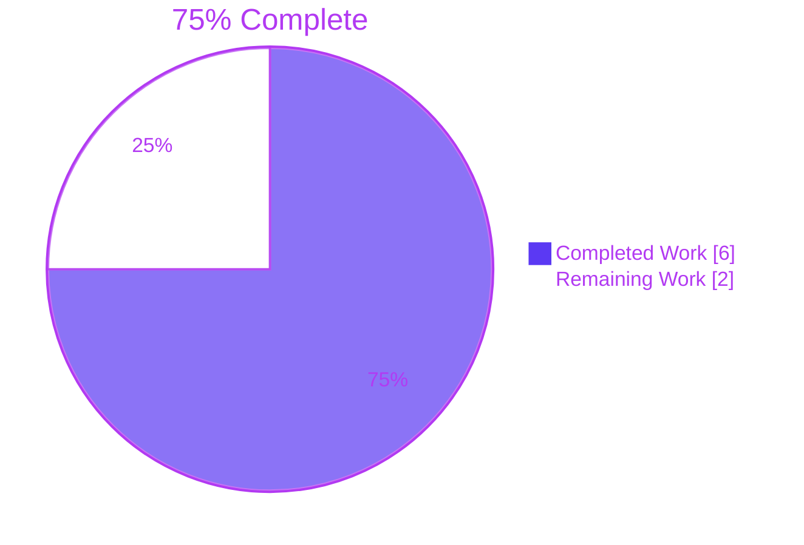
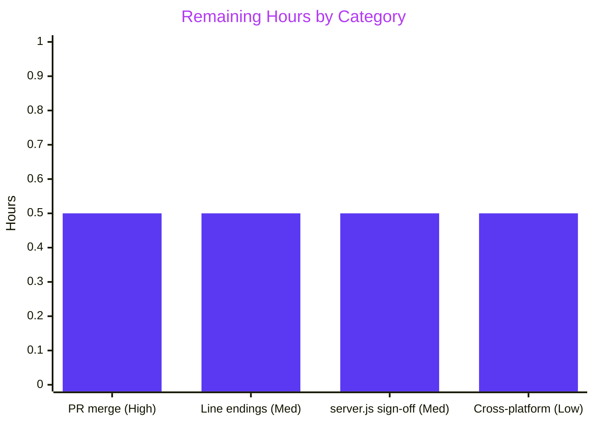

# 1. Executive Summary

## 1.1 Project Overview

This project adds `Welocme.js`, a zero-dependency JavaScript console script at the repository root that prints exactly `Welcome to Blitzy` and exits 0. The filename keeps the requester's spelling. Scope is deliberately one file, with no manifest, tests, build step or configuration, because the requester made simplicity a requirement. Users are developers and reviewers who run `node Welocme.js` as a runtime smoke test. The pre-existing `server.js` and `README.md` are out of scope and identical to `main`. The reference runtime is Node.js 24.x LTS, and 22.x is the supported floor.

## 1.2 Completion Status



| Metric | Value |
|---|---|
| Total Hours | 8 |
| Completed Hours (AI + Manual) | 6 (6 AI + 0 manual) |
| Remaining Hours | 2 |
| Percent Complete | **75%** |

6 hours completed out of 8 total hours = 75% complete. Every AAP deliverable is complete. The remaining 2 hours cover merging, sign-off and environment work.

## 1.3 Key Accomplishments

- [x] `Welocme.js` writes the 18-byte line `Welcome to Blitzy\n`, nothing to stderr, and exits 0 on Node 24.21.0 and 22.23.3
- [x] The source is exactly `console.log("Welcome to Blitzy");` plus one LF: 34 bytes, with no BOM, CR or comment (blob `651ed99`)
- [x] The file is named `Welocme.js` as requested, and no `Welcome.js` exists
- [x] The net change against `main` is one added line in one file; `server.js` and `README.md` are unchanged
- [x] Zero dependencies, build steps and configuration files; all 10 AAP prohibitions hold
- [x] Rule 1 performance, measured: about 4.5 ms and under 1 MB above a bare Node start; `server.js` start-up and latency unaffected
- [x] The script reads no input: hostile arguments, stdin, environment and working directory leave the output unchanged
- [x] The acceptance gate passes 7 of 7 checks on both supported Node lines

## 1.4 Critical Unresolved Issues

0 of 5 AAP functional requirements are open. 4 items remain open. One is a line-ending policy decision. The other three are pre-existing `server.js` behaviours, accepted with a caveat and awaiting owner sign-off. None of the four changes the script's output.

| Issue | Impact | Owner | ETA |
|---|---|---|---|
| A fresh checkout on a host whose Git sets `core.autocrlf=true` writes `Welocme.js` as 35 bytes with CRLF | The byte-exact acceptance check fails; the printed output is still correct | Repository owner | Before merge (0.5 h) |
| `server.js` has no security hardening: no security headers, and every method, path and body returns 200 | Pre-existing LOW risk, on a loopback-only server | Repository owner | Sign-off (0.5 h, shared) |
| A second `server.js` instance crashes with an unhandled `EADDRINUSE` | Pre-existing behaviour: exit 1 with a stack trace | Repository owner | Sign-off (shared) |
| Lighthouse cannot score `server.js`, because it serves `text/plain` (`NOT_HTML`) | Performance is covered by a DevTools trace instead (LCP 74 ms, FCP 73.51 ms, CLS 0) | Repository owner | Sign-off (shared) |

## 1.5 Access Issues

No access issues identified. The branch is pushed and level with `origin`, and the script needs no credentials, services or network access.

## 1.6 Recommended Next Steps

1. [High] Review the pull request and squash-merge it to `main`.
2. [Medium] Settle the line-ending policy: clone with `git clone -c core.autocrlf=input`, or amend the AAP to allow a `.gitattributes` entry.
3. [Medium] Sign off the three accepted `server.js` caveats, or raise a separate change request for hardening.
4. [Low] Run the acceptance gate on a Linux or macOS runner.

# 2. Project Hours Breakdown

## 2.1 Completed Work Detail

| Component | Hours | Description |
|---|---|---|
| `Welocme.js` script and exact literals (FR-1 to FR-5) | 1 | One top-level `console.log("Welcome to Blitzy");` at the repository root, with the requester's filename. Host (Node.js), output API, quote style and implicit exit settled as the AAP specifies |
| Byte-exact source and checkout line endings (AAP 0.4.2, 0.8) | 1 | Committed blob is 34 bytes with LF, no BOM and no CR. Checkout set to `core.autocrlf=input`, with the worktree, index and HEAD copies all identical |
| Acceptance gate on Node 24.x and 22.x (AAP 0.9, 0.12.2) | 1 | Run and exit code, `cat -A`, `wc -l`, filename, worktree and index `cmp`, and scope against `main`, on v24.21.0 and v22.23.3 |
| Static compliance review (AAP 0.6, 0.8, Rule 1) | 1 | 5 of 5 FRs, 6 budget counts, 10 prohibitions (0 violated), 18 out-of-scope artefacts (0 added), a proven zero-comment count, and the Rule 1 verdict |
| Security and performance verification (AAP 0.12.2, Rule 1) | 1 | Hostile argv, stdin, environment and cwd inputs; leak and process-surface checks; run-time, memory, concurrency and `server.js` A/B measurements |
| Pre-existing system continuity (AAP 0.6.2) | 1 | `server.js` and `README.md` held byte-identical to `main`; `server.js` responses compared against `main` across 10 raw request cases |
| **Total** | **6** | |

## 2.2 Remaining Work Detail

| Category | Hours | Priority |
|---|---|---|
| Review the pull request and squash-merge to `main`; confirm the Rule 1 language resolution and the one-file net diff | 0.5 | High |
| Line-ending policy for Windows checkouts: provision `core.autocrlf=input`, or amend the AAP to allow `.gitattributes` | 0.5 | Medium |
| Sign off the accepted `server.js` caveats: hardening left out of scope, the `EADDRINUSE` waiver, and the Lighthouse trace substitute | 0.5 | Medium |
| Run the acceptance gate on Linux or macOS with Node 22.x or 24.x | 0.5 | Low |
| **Total** | **2** | |

## 2.3 Hours Calculation

- Completed: 1 + 1 + 1 + 1 + 1 + 1 = **6 hours**
- Remaining: 0.5 + 0.5 + 0.5 + 0.5 = **2 hours**
- Total: 6 + 2 = **8 hours**
- Completion: 6 / 8 × 100 = **75%**

Confidence is high. Every item has a narrow, well-defined scope. The remaining items are decisions and one smoke run, with no implementation work.

# 3. Test Results

The project has no unit-test framework or coverage tooling, because AAP §0.6.2 and §0.12.2 forbid adding them. Its test surface is the AAP §0.9 acceptance set, run as a Git Bash gate script plus PowerShell byte checks from the repository root. Every count below was run and observed on the final tree (`f868684`).

| Area / Category | Framework | Tests | Passed | Failed | Coverage | What This Proves |
|---|---|---|---|---|---|---|
| Output contract (FR-1, FR-2, FR-5) | Gate (`cat -A`, `wc -l`, run/exit) and PowerShell byte compare | 12 | 12 | 0 | N/A | Both Node lines print exactly `Welcome to Blitzy` plus one LF, with 0 bytes on stderr and exit 0 |
| Direct execution without a build step (FR-4) | `node --check` | 3 | 3 | 0 | N/A | `Welocme.js` parses on v24.21.0 and v22.23.3, and `server.js` still parses |
| Source byte-exactness (AAP 0.4.2, 0.8) | `cmp`, byte compare, `git ls-files --eol` | 6 | 6 | 0 | N/A | The file is the planned 34-byte statement, identical in worktree and index, with no second statement |
| Filename (FR-3) | `grep -x`, `Get-ChildItem`, `Test-Path` | 4 | 4 | 0 | N/A | `Welocme.js` exists at the root and `Welcome.js` does not |
| One-file scope (AAP 0.6) | `git diff` against `main`, plus `git status` | 2 | 2 | 0 | N/A | `Welocme.js` is the only path that differs from `main` |
| Input invariance (AAP 0.12.2) | Run with extra arguments; run with piped stdin | 2 | 2 | 0 | N/A | Arguments and stdin are ignored, so the output stays constant |
| Checkout provisioning | Fresh clone with `-c core.autocrlf=input`; re-checkout after the local setting | 2 | 2 | 0 | N/A | Both provisioning methods produce the 34-byte LF file |
| **Total** | | **31** | **31** | **0** | N/A | |

**Not Covered**
- **Non-Windows hosts.** Every run was on Windows Server 2022. Run the gate on Linux or macOS before relying on those platforms.
- **Browser host.** AAP §0.2.1 notes the file also works in a devtools console or through a `<script>` tag. That path was never exercised.
- **Default checkouts on hosts where Git sets `core.autocrlf=true`.** A plain `git clone` here produced a 35-byte CRLF file, which fails the byte check. Provision the checkout as described in Section 9 before running acceptance.
- **Regression protection inside the repository.** No test lives in the repo, by AAP design. Any future edit to `Welocme.js` must re-run the gate by hand.

# 4. Runtime Validation & UI Verification

The deliverable has no UI: its only surface is one line on standard output. Runtime validation covered the script itself and the pre-existing server it sits beside.

- ✅ **Operational: start-up and output on Node 24.21.0.** `node Welocme.js` writes 18 bytes (`Welcome to Blitzy\n`), 0 bytes to stderr, and exits 0.
- ✅ **Operational: Node 22.23.3 floor.** The output is byte-identical and the exit code is 0.
- ✅ **Operational: invocation variants.** File and pipe redirection, early-closed pipes, 20-, 50- and 100-way concurrent runs, and 300 sequential runs all produced the exact line, with no leftover process.
- ✅ **Operational: input and leak surface.** Hostile argv, stdin, environment and cwd values leave the output constant. No environment value leaks, and no socket, file write or child process occurs. The script also runs under Node's `--permission` model.
- ✅ **Operational: Rule 1 performance.** Median run time is about 51 ms, against about 46 ms for a bare `node -e 0`, and peak memory is 364 KB higher. `server.js` cold start (64.4 ms with the file, 65.4 ms without) and endpoint latency (0.97 ms and 0.98 ms) are unaffected.
- ✅ **Operational: `server.js` continuity.** The blob is identical to `main`. Ten raw request cases, including GET, HEAD, POST, DELETE, `OPTIONS *`, absolute-form and a 3-request pipeline, are byte-identical to `main`. `/Welocme.js` is never served or loaded.
- ⚠ **Partial: `server.js` port collision.** A second instance on an occupied port exits 1 with an unhandled `EADDRINUSE` stack trace, exactly as on `main`. The behaviour is accepted as pre-existing.
- ⚠ **Partial: `server.js` Lighthouse.** Every desktop and mobile run stops with `NOT_HTML`, because the page is `text/plain`. A DevTools trace stands in for the score: LCP 74 ms, FCP 73.51 ms, CLS 0.00, with 0 console messages.
- ⚠ **Partial: default checkout line endings.** On a host whose Git sets `core.autocrlf=true`, a plain clone writes a 35-byte CRLF file. The output is still correct, but the byte-exact check fails until the checkout is provisioned.

**Never exercised at runtime:** browser-host invocation of `Welocme.js`, and any non-Windows operating system.

# 5. Compliance & Quality Review

## 5.1 Compliance Matrix

| # | AAP Deliverable / Benchmark | Status | Progress | Evidence |
|---|---|---|---|---|
| 1 | FR-1: exact string `Welcome to Blitzy` | ✅ Pass | 100% | Gate `cat -A` gives `Welcome to Blitzy$`, and stdout bytes compare equal |
| 2 | FR-2: once, one line, single LF, nothing else | ✅ Pass | 100% | `wc -l` = 1; 18 bytes on stdout, 0 bytes on stderr |
| 3 | FR-3: `Welocme.js` at the root, no `Welcome.js` | ✅ Pass | 100% | `ls -1 \| grep -x 'Welocme.js'`; `Test-Path Welcome.js` is False |
| 4 | FR-4: JavaScript, no install or build step | ✅ Pass | 100% | `node --check` exits 0 on 24.21.0 and 22.23.3; no manifest |
| 5 | FR-5: exit 0 and no other action | ✅ Pass | 100% | Exit code 0; `cmp` proves the file holds only the planned statement |
| 6 | Exact source: 34 bytes, LF, no BOM or comment, double quotes, semicolon (§0.4.2, §0.12.1) | ✅ Pass (⚠ default Windows checkouts) | 100% | `Welocme.js:1`, blob `651ed99`, `i/lf w/lf`; see divergence 2 |
| 7 | Simplicity budget and 10 prohibitions (§0.8) | ✅ Pass | 100% | 1 line, 1 file, 0 dependencies, 0 build steps, 0 config files, 0 directories |
| 8 | One-file scope; 18 out-of-scope artefacts absent (§0.6) | ✅ Pass | 100% | `git diff --name-status origin/main HEAD` gives `A Welocme.js` only |
| 9 | Runtime: 24.x reference, 22.x floor (§0.3.1) | ✅ Pass | 100% | Gate passes on v24.21.0 and v22.23.3 |
| 10 | Rule 1: separated flows, no performance impact | ✅ Pass | 100% | One flow in one file; about 4.5 ms per run; `server.js` A/B unchanged |
| 11 | Rule 1: Python as the language | ⚠ Diverged (sanctioned) | n/a | JavaScript per AAP §0.10.2; see divergence 1 |
| 12 | Security and zero-placeholder quality (§0.12.2) | ✅ Pass | 100% | No input read; `git grep` finds no TODO or FIXME; 0 comments |

## 5.2 AAP & Rule Divergences and Gaps

| # | What the AAP/Rule Required | What Was Delivered Instead | Why It Diverged | Impact | Remediation |
|---|---|---|---|---|---|
| 1 | Rule 1: "Create a product in Python" | JavaScript `Welocme.js` (**Sanctioned**) | The requester asked for JavaScript and named a `.js` file; AAP §0.10.2 lets that instruction govern | None on behaviour; the rule's language clause is not followed | Confirm at PR review |
| 2 | §0.4.2/§0.9: a 34-byte LF file on disk; §0.6.2: no extra files | The LF blob is committed, but on-disk bytes depend on each checkout's Git config; no `.gitattributes` | The only versioned EOL control is a file that the one-file scope forbids | A default clone on an `autocrlf=true` host is 35 bytes with CRLF and fails `cmp` | Provision `core.autocrlf=input`, or amend the AAP |
| 3 | §0.9: a `find` inventory diff taken before and after, written to `../inventory-*.txt` | A Git scope check against base `48e0032`, run under Git Bash | No baseline inventory was captured before creation, and the parent directory is shared | Equivalent proof; untracked `blitzy/` evidence has to be excluded | None required |
| 4 | §0.6.2: the web server is out of scope | `server.js` kept byte-identical to `main`, with its hardening gaps accepted | Hardening would modify an out-of-scope file and break the one-file gate | LOW: a loopback server without security headers or method and body limits | Accept, or raise a separate change request |
| 5 | Release verification expects a clean failure on port collision and a Lighthouse score for the served page | Both `server.js` behaviours kept as on `main`, with a trace substitute for the score | Out of scope; changing the `Content-Type` would alter pre-existing behaviour | A second instance crashes; no Lighthouse score | Formally accept both waivers |

**1. Python rule versus JavaScript request (Sanctioned).** Rule 1 names Python. The request says "in Java script" and "Store the code in `Welocme.js`": two consistent signals for JavaScript. AAP §0.10.2 lets the specific instruction govern its own artefact. Honouring Python would need either a `.py` file, which breaks the filename instruction, or Python inside a `.js` file, which nothing can run. `Welocme.js:1` is the JavaScript statement, and the tree holds no `.py` or `requirements.txt`. The rule's other two clauses, separation and performance, are met and measured (Section 4). No code change is needed. The owner only has to confirm at review that the requester's instruction takes precedence over the standing rule.

**2. Line endings rely on checkout configuration.** Blob `651ed99` is the exact 34-byte LF statement. On Windows hosts whose system Git config sets `core.autocrlf=true`, as the verification host's does, a default `git clone` writes a 35-byte CRLF `Welocme.js`, and `printf … | cmp - Welocme.js` fails at char 34. The printed output is unaffected. `.gitattributes` is the only way to version EOL behaviour, and AAP §0.6.2 and §0.8 forbid any second file, so the requirement is recorded in the messages of commits `b3f3642` and `89659a9`. The owner must choose: provision every Windows checkout with `git clone -c core.autocrlf=input`, or amend the AAP to allow `Welocme.js text eol=lf` in `.gitattributes`.

**3. Exclusivity check method.** AAP §0.9 captures `find . -path ./.git -prune -o -print` to `../inventory-before.txt` before creating the file, and diffs it afterwards. No baseline was taken before `Welocme.js` existed, and the parent directory is shared with other working copies on the build host. The gate therefore proves exclusivity with `git diff --name-only 48e0032 HEAD` plus `git status --porcelain --untracked-files=all`, which also gives provenance. The AAP's `echo $?`, `cat -A`, `wc -l` and `cmp` run in Git Bash, because PowerShell lacks them. The untracked `blitzy/screenshots/` directory (24 PNG files of verification evidence) is excluded from the scope check. No action is required beyond deleting that directory, or ignoring it locally.

**4. `server.js` hardening is not delivered.** The pre-existing `server.js` (`server.js:6-10`) answers every method, path and body with `200 text/plain`, and it sends no security headers. AAP §0.6.2 puts the web server out of scope, and the gate fails on any changed path besides `Welocme.js`, so the file stays byte-identical to `main` (blob `320a75a7`). The branch history holds a hardening commit (`caad54e`) and the commit that restores the original (`f868684`). Together they net to zero, so a squash merge leaves only the `Welocme.js` addition. The risk is LOW, because the server binds only to 127.0.0.1. If hardening is wanted, widen the scope in a separate change request; `caad54e` can serve as its starting point.

**5. `server.js` lifecycle and performance-measurement waivers.** `server.listen` (`server.js:12`) has no `'error'` listener, and the port is hard-coded as 3000 (`server.js:4`). A second instance therefore exits 1 with an unhandled `EADDRINUSE` stack trace, which is identical to `main`. `server.js:8` serves `text/plain`, so Lighthouse aborts with `NOT_HTML` on desktop and mobile. A DevTools trace (LCP 74 ms, FCP 73.51 ms, CLS 0) stands in for the score. Fixing either behaviour means editing an out-of-scope file, and changing the content type only to obtain a score would alter existing behaviour. The owner should formally accept both waivers, or request a configurable port and an error handler as separate work.

# 6. Risk Assessment

| Risk | Category | Severity | Probability | Mitigation | Status |
|---|---|---|---|---|---|
| A default checkout on a host whose Git sets `core.autocrlf=true` writes a 35-byte CRLF `Welocme.js` that fails byte-exact acceptance | Technical | Medium | High on such hosts, Low elsewhere | Clone with `-c core.autocrlf=input`, or sanction `.gitattributes` with `Welocme.js text eol=lf` | Open |
| No regression test lives in the repository, so a future edit could change the output unnoticed | Technical | Low | Low | Keep the Section 9 gate in team tooling and re-run it after any edit | Accepted (AAP §0.12.2) |
| The pre-existing `server.js` sends no security headers and accepts any method, path or body | Security | Low | Low (loopback bind only) | Separate change request before exposing it beyond 127.0.0.1 | Accepted |
| `server.js` hard-codes port 3000 and crashes on `EADDRINUSE` | Operational | Low | Medium on shared hosts | Run one instance per host, or request a configurable port and an error listener | Accepted |
| Node runtime patch drift; 22.x reaches end-of-life on 2027-04-30 | Operational | Low | Medium over time | Keep the deployed line on its latest security patch, and move to 24.x before the 22.x end-of-life | Open |
| A maintainer "corrects" the filename to `Welcome.js`, which breaks FR-3 | Operational | Low | Low | Note the intentional spelling in the PR description and owner documentation | Open |
| The script has only been run on Windows; Linux, macOS and browser hosts are unverified | Integration | Low | Low | Run the gate on a Linux or macOS runner | Open |
| The branch history carries a `server.js` commit and its reversal, which could confuse `git blame` or be cherry-picked | Integration | Low | Medium | Squash-merge the pull request | Open |

# 7. Visual Project Status


**Remaining hours by priority (2 hours total):**



| Priority | Tasks | Hours |
|---|---|---|
| High | 1 | 0.5 |
| Medium | 2 | 1.0 |
| Low | 1 | 0.5 |
| **Total** | **4** | **2** |

# 8. Summary & Recommendations

The project is **75% complete**: 6 of 8 hours are delivered, and every AAP deliverable is done. `Welocme.js` is the single planned statement `console.log("Welcome to Blitzy");` plus one LF, at the repository root under the requester's spelling. It prints exactly one 18-byte line and exits 0 on Node 24.21.0 and 22.23.3. Against `main`, the net change is one added line in one file. There are no dependencies, build steps, configuration files or documentation files, and all 10 simplicity prohibitions hold.

Verification is complete for the deliverable. 31 of 31 acceptance checks passed on the final tree, covering the output contract, direct execution, byte-exactness, filename, scope, input invariance and checkout provisioning. Runtime probing shows that the script reads no input, leaks nothing, opens no socket and writes no file. Rule 1's performance clause was measured, not argued: about 4.5 ms and under 1 MB above a bare Node start, with no change to `server.js` start-up or latency.

The remaining 2 hours are sign-off and environment work, with no implementation. The one item that touches the deliverable is line endings. On hosts whose Git sets `core.autocrlf=true`, a default clone writes a 35-byte CRLF file that fails the byte-exact check, although the output stays correct. The other three open items are accepted, pre-existing `server.js` behaviours that sit outside AAP scope: no hardening, a crash on port collision, and no Lighthouse score.

The critical path to production is short. First, review the pull request and squash-merge it, so the history carries only the `Welocme.js` addition. Second, settle the line-ending policy for Windows checkouts. Third, sign off the `server.js` waivers. Finally, run the gate once on Linux or macOS. Success means `node Welocme.js` prints `Welcome to Blitzy` with exit 0, `cmp` passes against the planned 34 bytes, and `main` differs from its previous state only by `Welocme.js`.

**Production readiness:** the script is ready to ship. The repository is ready to merge once the owner confirms the Rule 1 language resolution (Section 5.2, item 1) and chooses a line-ending policy.

# 9. Development Guide

## 9.1 System Prerequisites

- **Node.js 24.x LTS** (reference line; verified on v24.21.0) or **22.x** (supported floor; verified on v22.23.3). Stay on a patched release: at least 22.12.0 on the 22.x line.
- **Git 2.x.** On Windows, use Git for Windows, whose Git Bash runs the POSIX acceptance commands (verified with git 2.55.0 and bash 5.3.15).
- **A shell.** Windows PowerShell 5.1 works for running the script; Linux and macOS shells work unchanged.
- No other software is needed: no npm packages, database, container, virtual environment or build tool.

## 9.2 Environment Setup

Clone with LF-preserving checkout. This matters on Windows hosts whose Git sets `core.autocrlf=true`:

```powershell
git clone -c core.autocrlf=input <repository-url>
cd <repository-folder>
git checkout blitzy-3b42b04f-d4aa-448d-af35-f2c0605e9afa
```

If a clone already exists, fix it in place from the repository root:

```powershell
git config --local core.autocrlf input
Remove-Item Welocme.js
git checkout -- Welocme.js
git ls-files --eol Welocme.js      # expect: i/lf    w/lf
(Get-Item Welocme.js).Length       # expect: 34
```

Put the Node line you want first on `PATH` for the session:

```powershell
$env:Path = '<node-24-install-folder>;' + $env:Path
node --version                     # expect: v24.x (v22.x is also valid)
```

No environment variables are required. The script reads none.

## 9.3 Dependency Installation

None. There is no `package.json`, so do **not** run `npm install`. When editing `Welocme.js`, write it from the terminal, so that no editor converts the line ending:

```powershell
[IO.File]::WriteAllText("$PWD\Welocme.js", 'console.log("Welcome to Blitzy");' + "`n")
```

## 9.4 Running the Application

```powershell
node Welocme.js
$LASTEXITCODE
```

Expected output:

```text
Welcome to Blitzy
0
```

On Linux or macOS, run `node Welocme.js; echo $?`. The pre-existing `server.js` is outside this project's scope, and nothing here requires starting it.

## 9.5 Verification Steps

**Quick byte check (PowerShell, from the repository root):**

```powershell
$scratch = Join-Path $env:TEMP 'welocme-check'; New-Item -ItemType Directory -Force $scratch | Out-Null
node --check Welocme.js; "check_exit=$LASTEXITCODE"
cmd /c "node Welocme.js > `"$scratch\out.bin`""; "run_exit=$LASTEXITCODE"
$enc = [Text.Encoding]::ASCII
"stdout_ok=" + ($enc.GetString([IO.File]::ReadAllBytes("$scratch\out.bin")) -ceq ('Welcome to Blitzy' + "`n"))
"file_ok="   + ($enc.GetString([IO.File]::ReadAllBytes("$PWD\Welocme.js")) -ceq ('console.log("Welcome to Blitzy");' + "`n"))
"name_ok="   + ((Get-ChildItem -Name -File) -ccontains 'Welocme.js')
```

Pass condition: `check_exit=0`, `run_exit=0`, and all three `_ok` values `True`.

**Full acceptance gate (AAP §0.9 plus scope).** Write the script with LF endings, then run it from the repository root. Keep the here-string's closing `'@` at column 0.

```powershell
$gate = @'
set -u
fail=0
echo "node $(node --version)"
out="$(node Welocme.js; echo "rc=$?")"
[ "$out" = "Welcome to Blitzy
rc=0" ] || { echo "FAIL run/exit"; fail=1; }
[ "$(node Welocme.js | cat -A)" = 'Welcome to Blitzy$' ] || { echo "FAIL cat -A"; fail=1; }
[ "$(node Welocme.js | wc -l)" = "1" ] || { echo "FAIL wc -l"; fail=1; }
[ "$(ls -1 | grep -x 'Welocme.js')" = "Welocme.js" ] || { echo "FAIL filename"; fail=1; }
printf 'console.log("Welcome to Blitzy");\n' | cmp - Welocme.js || { echo "FAIL cmp worktree"; fail=1; }
git cat-file -p :Welocme.js | cmp - Welocme.js || { echo "FAIL cmp index blob"; fail=1; }
extra="$( { git diff --name-only 48e00328a422a1040c803a428f357edc9add8ea4 HEAD; git status --porcelain --untracked-files=all | cut -c4-; } | sort -u | grep -vx 'Welocme.js' | grep -v '^blitzy/' )"
[ -z "$extra" ] || { echo "FAIL scope, extra paths:"; echo "$extra"; fail=1; }
[ "$fail" = 0 ] && echo "GATE PASS" || echo "GATE FAIL"
exit $fail
'@
[IO.File]::WriteAllText("$scratch\gate.sh", ($gate -replace "`r`n", "`n"))
$gatePath = ($scratch -replace '\\','/') + '/gate.sh'
& "$env:ProgramFiles\Git\bin\bash.exe" $gatePath; "gate_exit=$LASTEXITCODE"
```

Pass condition: `GATE PASS` and `gate_exit=0`. On Linux or macOS, save the same script body as `gate.sh` and run `bash gate.sh` from the repository root. The `grep -v '^blitzy/'` filter skips the untracked verification-evidence folder. Delete that folder instead if you prefer the literal AAP check.

## 9.6 Example Usage

```powershell
node Welocme.js | Measure-Object -Line          # Lines: 1
node Welocme.js --any args                      # extra arguments are ignored
'input' | node Welocme.js                       # stdin is ignored
cmd /c "node Welocme.js > greeting.txt"; (Get-Item greeting.txt).Length; Remove-Item greeting.txt   # 18
```

Use `cmd /c` for byte-level captures. The PowerShell 5.1 `>` operator re-encodes output as UTF-16 with CRLF, which gives 40 bytes instead of the script's 18.

## 9.7 Troubleshooting

| Symptom | Cause | Resolution |
|---|---|---|
| `cmp: - Welocme.js differ: char 34, line 1`, or the file is 35 bytes | The checkout converted LF to CRLF because Git sets `core.autocrlf=true` | Run the fix-in-place commands in 9.2 |
| `Error: Cannot find module ...Welocme.js` | The command ran from the wrong directory, or the filename was "corrected" | Run from the repository root; the name is `Welocme.js` |
| `cat`, `wc` or `cmp` not recognised | They are POSIX tools that PowerShell lacks | Run them through the Git Bash gate script in 9.5 |
| Quotes are mangled in `bash -c "..."` | PowerShell 5.1 rewrites embedded double quotes | Put Bash commands in a script file, as 9.5 does |
| The gate prints `FAIL scope` for `blitzy/...` paths | Untracked verification evidence sits in the working tree | Keep the `^blitzy/` filter, or delete the folder |
| The editor saves with CRLF | Some Windows editors write CRLF | Write the file with the `[IO.File]::WriteAllText` command in 9.3 |
| A redirected output file is 40 bytes | The PowerShell 5.1 `>` operator re-encodes output as UTF-16 | Capture with `cmd /c "node Welocme.js > file"` |

# 10. Appendices

## A. Command Reference

| Purpose | Command (repository root) | Expected Result |
|---|---|---|
| Run the script | `node Welocme.js` | `Welcome to Blitzy`, exit 0 |
| Syntax check | `node --check Welocme.js` | No output, exit 0 |
| Line-ending state | `git ls-files --eol Welocme.js` | `i/lf    w/lf` |
| Keep LF on checkout | `git config --local core.autocrlf input` | Local override of the system `true` |
| Clone with LF | `git clone -c core.autocrlf=input <repository-url>` | `Welocme.js` is 34 bytes |
| Byte-exact source (Git Bash) | `printf 'console.log("Welcome to Blitzy");\n' \| cmp - Welocme.js` | No output, exit 0 |
| Visible line ending (Git Bash) | `node Welocme.js \| cat -A` | `Welcome to Blitzy$` |
| Line count (Git Bash) | `node Welocme.js \| wc -l` | `1` |
| Scope against the base | `git diff --name-status 48e0032 HEAD` | `A	Welocme.js` |
| Full gate | See Section 9.5 | `GATE PASS`, exit 0 |

## B. Port Reference

| Component | Port | Notes |
|---|---|---|
| `Welocme.js` | None | Binds nothing and opens no socket |
| `server.js` (pre-existing, out of scope) | 127.0.0.1:3000 | Hard-coded; a second instance exits with `EADDRINUSE` |

## C. Key File Locations

| Path | Role |
|---|---|
| `Welocme.js` | The deliverable: one statement, 34 bytes, LF |
| `server.js` | Pre-existing Node `http` catch-all server; unchanged from `main` |
| `README.md` | Pre-existing project title and description; unchanged from `main` |
| `blitzy/screenshots/` | Untracked verification evidence (24 PNG files); not part of the product, and never committed |

## D. Technology Versions

| Technology | Version | Role |
|---|---|---|
| Node.js | 24.21.0 | Reference runtime (24.x LTS "Krypton", end-of-life 2028-04-30) |
| Node.js | 22.23.3 | Supported floor (22.x "Jod", end-of-life 2027-04-30) |
| Git for Windows | 2.55.0.windows.5 | Version control; line-ending conversion |
| GNU Bash (Git for Windows) | 5.3.15 | Runs the POSIX acceptance commands |
| Windows PowerShell | 5.1 | Host shell used for verification |
| JavaScript | ES5-level syntax | One call expression with a string literal |

## E. Environment Variable Reference

| Variable | Required | Used by `Welocme.js` | Notes |
|---|---|---|---|
| None | — | — | The script reads no environment variables |
| `DB_HOST` | No | No | Present on the host; nothing in the repository reads it |
| `PATH` | Yes | Indirectly | Must resolve `node` to a 22.x or 24.x install |

## F. Developer Tools Guide

- **`git ls-files --eol <file>`** shows the index (`i/`) and worktree (`w/`) line endings. Use it first whenever the byte check fails.
- **`git hash-object --no-filters Welocme.js`** hashes the raw worktree bytes. The result must equal blob `651ed99793dd0f3fda73cbb37f4e5ef94972df2b`.
- **`cmp`, `cat -A`, `wc -l`, `od -c`** (Git Bash) inspect bytes. PowerShell text redirection re-encodes output, so use `cmd /c "... > file"` or these tools for byte-level checks.
- **`NODE_DEBUG=module node Welocme.js`** confirms that only the entry file is resolved, with no third-party modules.
- **Editing:** write `Welocme.js` with `[IO.File]::WriteAllText` (Section 9.3), or with an editor set to LF line endings, and never add a BOM.

## G. Glossary

| Term | Meaning |
|---|---|
| AAP | Agent Action Plan: the agreed specification for this change |
| FR-1 to FR-5 | The five functional requirements: exact string, single line, filename, no build step, exit 0 |
| LF / CRLF | Unix (`\n`) versus Windows (`\r\n`) line terminators; the source must end in exactly one LF |
| `core.autocrlf` | Git setting that converts line endings on checkout. `true` writes CRLF; `input` keeps LF |
| Acceptance gate | The Bash script in Section 9.5 that runs the AAP §0.9 checks plus a scope check |
| Blob | Git's stored content object; `651ed99` is the committed `Welocme.js` |
