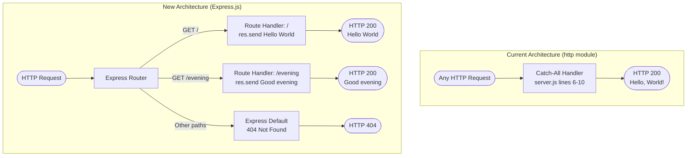
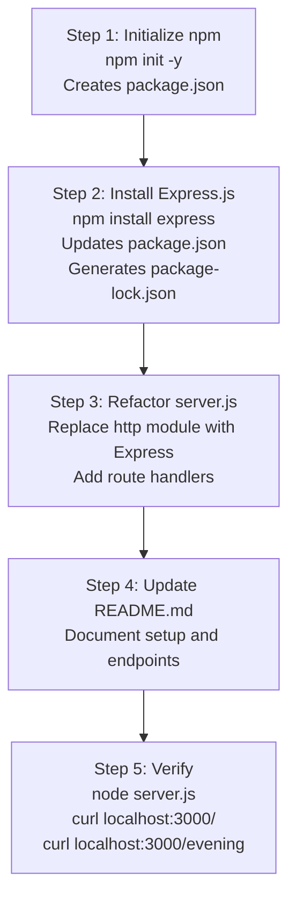

# Technical Specification

# 0. Agent Action Plan

## 0.1 Intent Clarification


### 0.1.1 Core Feature Objective

Based on the prompt, the Blitzy platform understands that the new feature requirement is to **integrate the Express.js web framework into an existing minimal Node.js HTTP server and add a new HTTP endpoint** that returns a specific response. The user's original statement is:

> *"this is a tutorial of node js server hosting one endpoint that returns the response 'Hello world'. Could you add expressjs into the project and add another endpoint that return the response of 'Good evening'?"*

This translates into the following discrete feature requirements:

- **FR-1: Integrate Express.js Framework** — Replace the current bare Node.js `http.createServer()` implementation in `server.js` with an Express.js application instance. The project currently has zero dependencies and no `package.json`; this requirement introduces npm package management and the Express.js framework as the sole external dependency.

- **FR-2: Preserve Existing "Hello World" Endpoint** — The current server responds with `Hello, World!\n` to every HTTP request regardless of path or method (as documented in `server.js` lines 6–10). After the Express.js migration, an equivalent endpoint must continue to return a "Hello world" response. This endpoint will be formalized as a specific route (e.g., `GET /`) rather than the current catch-all behavior.

- **FR-3: Add New "Good Evening" Endpoint** — Create a new, distinct HTTP endpoint that returns the response `"Good evening"` as specified by the user. This requires Express.js route registration for a dedicated path (e.g., `GET /evening`).

- **FR-4: Maintain Server Characteristics** — The server should continue to bind to port `3000`, use CommonJS module syntax (consistent with the existing `require()` pattern in the codebase), and log a startup confirmation message to stdout.

**Implicit requirements detected:**
- A `package.json` manifest must be created to manage the Express.js dependency, since none currently exists in the repository.
- A `package-lock.json` will be generated automatically by npm to lock dependency versions.
- The `README.md` should be updated to reflect the new project setup instructions (now requiring `npm install` before running).

### 0.1.2 Special Instructions and Constraints

- **Maintain backward compatibility**: The existing "Hello, World!" behavior accessible at the root path must be preserved after migration to Express.js.
- **Follow repository conventions**: The current codebase uses CommonJS (`require()`) module syntax as evidenced in `server.js` line 1. All new code must continue to use CommonJS rather than ES Modules (`import`).
- **Tutorial-level simplicity**: The user explicitly described this project as a "tutorial," so the implementation must remain straightforward, readable, and educational in nature — no unnecessary abstractions or over-engineering.
- **User Rule — "create new feature"**: The user has specified an implementation rule named `Ajit_AddNewFeature_Rule_Simple` with the directive to "create new feature," confirming this is a feature addition exercise.

### 0.1.3 Technical Interpretation

These feature requirements translate to the following technical implementation strategy:

- To **integrate Express.js** (FR-1), we will initialize npm in the project root to create `package.json`, install `express@5.2.1` as a production dependency, and refactor `server.js` to import and use the Express application factory (`const express = require('express')`) instead of the raw `http` module.

- To **preserve the existing "Hello World" response** (FR-2), we will register an Express route handler `app.get('/')` that sends the `"Hello World"` response, mapping the current catch-all behavior to a specific root-path GET endpoint.

- To **add the "Good evening" endpoint** (FR-3), we will register an additional Express route handler `app.get('/evening')` that returns the plain-text response `"Good evening"`.

- To **maintain server characteristics** (FR-4), we will retain the port `3000` binding, use `app.listen(3000, ...)` with a startup confirmation callback logging the server URL to stdout, and keep all code in CommonJS format.

- To **support the new dependency workflow**, we will create `package.json` via `npm init` and document the `npm install` step in an updated `README.md`.


## 0.2 Repository Scope Discovery


### 0.2.1 Comprehensive File Analysis

The repository is a flat, two-file project with no subdirectories, no `package.json`, no `node_modules`, and no configuration files. Every file in the repository has been inspected and its relevance to this feature addition is documented below.

**Existing Files Requiring Modification:**

| File Path | Current Purpose | Required Changes | Lines Affected |
|-----------|----------------|------------------|----------------|
| `server.js` | Sole application entry point; 14-line HTTP server using Node.js built-in `http` module with a single catch-all handler returning `Hello, World!\n` | Refactor to use Express.js: replace `http.createServer()` with Express app, register `GET /` route for "Hello World", add `GET /evening` route for "Good evening", update `listen()` call | All lines (1–14) — full rewrite |
| `README.md` | 2-line project descriptor: heading `# hao-backprop-test` and description "test project for backprop integration" | Update to document Express.js dependency, new `npm install` setup step, available endpoints, and usage instructions | All lines (1–2) — expanded content |

**Integration Point Discovery:**

| Integration Category | Current State | Impact of Feature Addition |
|---------------------|---------------|---------------------------|
| HTTP endpoint routing | None — all requests get identical response regardless of path/method (`server.js` lines 6–10) | Express.js introduces route-based dispatching; `GET /` and `GET /evening` will be distinct endpoints |
| Module system | Single `require('http')` import on line 1 | Changes to `require('express')` — the `http` module import is no longer needed as Express manages the underlying server |
| Server lifecycle | `http.createServer()` + `server.listen()` pattern | Replaced by `express()` app factory + `app.listen()` |
| Dependency management | Zero dependencies; no `package.json` | npm initialized; `express@5.2.1` added as production dependency |
| Startup confirmation | `console.log` in `.listen()` callback on line 13 | Preserved — `app.listen(port, callback)` supports the same callback pattern |

### 0.2.2 Web Search Research Conducted

The following research was conducted to inform implementation decisions:

| Research Topic | Finding | Source |
|---------------|---------|--------|
| Express.js latest stable version | Express.js v5.2.1 is the latest stable release on npm | npmjs.com/package/express |
| Express.js 5.x Node.js compatibility | Express 5 requires Node.js >= 18; Node.js v20.20.1 (project runtime) is fully compatible | Express.js GitHub releases, npmjs.com |
| Express.js 5.x key changes | Express 5 dropped support for Node.js < 18, updated path-to-regexp, added native async/await middleware support, removed deprecated Express 3/4 API methods | Express.js GitHub releases |
| Express.js basic routing pattern | `app.get(path, handler)` for registering GET route handlers; `res.send(body)` for sending responses | Express.js official documentation |

### 0.2.3 New File Requirements

**New source/configuration files to create:**

| File Path | Purpose | Generation Method |
|-----------|---------|-------------------|
| `package.json` | npm project manifest declaring project metadata and `express@5.2.1` as a production dependency | Created via `npm init -y` then updated by `npm install express` |
| `package-lock.json` | Deterministic dependency lock file pinning exact versions of Express.js and its transitive dependencies | Auto-generated by npm during `npm install express` |
| `node_modules/` | Directory containing installed Express.js package and its transitive dependencies | Auto-generated by npm during `npm install express` |

**No new test files are required** — the existing project has no test infrastructure, and the user's request is a tutorial-level feature addition that does not specify test coverage. However, the endpoints can be manually verified using `curl` commands.

**No new configuration files are required** — Express.js operates with sensible defaults for a tutorial project, requiring no additional config files (no `.env`, no `express.config.js`, no YAML).


## 0.3 Dependency Inventory


### 0.3.1 Private and Public Packages

The project currently has **zero** external dependencies. This feature addition introduces exactly one direct dependency:

| Package Registry | Package Name | Version | Purpose | Status |
|-----------------|-------------|---------|---------|--------|
| npm (public) | `express` | `5.2.1` | Minimalist web framework for Node.js — provides application factory, HTTP routing, request/response augmentation, and middleware pipeline | To be added |

**Version Justification:**
- Express.js `5.2.1` is the latest stable release as confirmed on npmjs.com.
- Express 5.x requires Node.js >= 18 — the project's runtime is Node.js v20.20.1 (Iron LTS), which satisfies this requirement.
- No user-specified version constraint was provided; the latest stable version is selected per best practice.

**Transitive Dependencies:**
Express.js 5.2.1 brings a set of well-known transitive dependencies managed automatically by npm. These include (but are not limited to) packages such as `accepts`, `body-parser`, `content-disposition`, `cookie`, `debug`, `finalhandler`, `merge-descriptors`, `parseurl`, `path-to-regexp`, `qs`, `send`, `serve-static`, and `type-is`. All transitive versions are locked in the auto-generated `package-lock.json`.

**Runtime Dependency:**

| Runtime | Version | Status | Evidence |
|---------|---------|--------|----------|
| Node.js | v20.20.1 | Already installed | Tech spec Section 3.1.1 confirms v20.20.1 available in build environment |
| npm | v11.1.0 | Already installed | Verified via `npm --version` |

### 0.3.2 Dependency Updates

**Import Updates:**

The sole application file `server.js` requires an import change:

| File | Current Import | New Import | Reason |
|------|---------------|------------|--------|
| `server.js` | `const http = require('http');` | `const express = require('express');` | Replacing the built-in `http` module with the Express.js framework, which manages the underlying HTTP server internally |

**External Reference Updates:**

| File | Change Type | Details |
|------|------------|---------|
| `package.json` | CREATE | New npm manifest with `express` listed under `dependencies` |
| `package-lock.json` | CREATE | Auto-generated lock file for deterministic installs |
| `README.md` | MODIFY | Add `npm install` as a prerequisite step; document new endpoints |

**Build/Deployment Changes:**

| Aspect | Before | After |
|--------|--------|-------|
| Start command | `node server.js` | `node server.js` (unchanged) |
| Setup prerequisite | None | `npm install` (one-time, to install Express.js) |
| Package manager | Not used | npm (initialized with `package.json`) |


## 0.4 Integration Analysis


### 0.4.1 Existing Code Touchpoints

**Direct modifications required:**

| File | Location | Modification | Details |
|------|----------|-------------|---------|
| `server.js` | Line 1 | Replace import | Change `const http = require('http');` to `const express = require('express');` |
| `server.js` | Line 3 | Remove hostname constant | The hardcoded `hostname` variable (`'127.0.0.1'`) is no longer needed; Express defaults to listening on all interfaces, but the port constant is retained |
| `server.js` | Line 4 | Retain port constant | `const port = 3000;` remains unchanged |
| `server.js` | Lines 6–10 | Replace server creation and handler | Replace `http.createServer((req, res) => { ... })` with Express app initialization (`const app = express()`) and individual route handlers |
| `server.js` | After line 10 | Add route: GET / | Register `app.get('/', (req, res) => { res.send('Hello World'); })` to preserve existing response behavior |
| `server.js` | After GET / | Add route: GET /evening | Register `app.get('/evening', (req, res) => { res.send('Good evening'); })` for the new endpoint |
| `server.js` | Lines 12–14 | Update listen call | Replace `server.listen(port, hostname, callback)` with `app.listen(port, callback)` retaining the startup log message |
| `README.md` | Lines 1–2 | Expand documentation | Add project description, setup instructions (`npm install`), run command, and endpoint documentation |

**Dependency injection points:**
- None required — Express.js is a self-contained framework that does not require a dependency injection container. The `express()` factory creates the application instance directly.

**Database/Schema updates:**
- None required — the project is fully stateless with no database layer.

### 0.4.2 Integration Flow Diagram

The following diagram illustrates how the refactored Express.js server processes requests through its routing layer, contrasted with the current catch-all approach:



**Key behavioral change:** The current server returns `Hello, World!\n` for every request to any path. After migration to Express.js, requests to unregistered paths will receive a 404 response (Express default behavior), while `GET /` and `GET /evening` will return their respective responses. This is expected and appropriate behavior for a route-based web framework.


## 0.5 Technical Implementation


### 0.5.1 File-by-File Execution Plan

Every file listed below MUST be created or modified as part of this feature addition.

**Group 1 — Core Feature Files:**

| Action | File | Purpose |
|--------|------|---------|
| MODIFY | `server.js` | Refactor from raw `http` module to Express.js application with two route handlers: `GET /` returning `"Hello World"` and `GET /evening` returning `"Good evening"` |

**Group 2 — Dependency and Configuration Files:**

| Action | File | Purpose |
|--------|------|---------|
| CREATE | `package.json` | npm project manifest declaring project name, version, entry point (`server.js`), and `express@5.2.1` as a production dependency |
| CREATE (auto) | `package-lock.json` | Deterministic lock file auto-generated by npm to pin exact dependency versions for reproducible installs |

**Group 3 — Documentation:**

| Action | File | Purpose |
|--------|------|---------|
| MODIFY | `README.md` | Update project documentation to reflect Express.js integration, prerequisites (`npm install`), available endpoints, and how to run the server |

### 0.5.2 Implementation Approach per File

**`server.js` — Core Application Refactor**

The entire 14-line file is rewritten to use Express.js while preserving the same server port and startup confirmation pattern. The transformation follows this approach:

- Replace `const http = require('http')` with `const express = require('express')`
- Create an Express application instance via `const app = express()`
- Register `GET /` route handler that calls `res.send('Hello World')`
- Register `GET /evening` route handler that calls `res.send('Good evening')`
- Replace `server.listen(port, hostname, callback)` with `app.listen(port, callback)` and retain the console.log startup message

The resulting file structure:

```javascript
const express = require('express');
const app = express();
const port = 3000;
// ... route handlers and app.listen()
```

**`package.json` — Project Manifest**

Created by running `npm init -y` in the project root, then populated with `express@5.2.1` under `dependencies` via `npm install express`. The manifest captures the project name, version, description, entry point (`server.js`), and the Express.js dependency with its pinned version.

**`package-lock.json` — Dependency Lock**

Auto-generated by npm during the `npm install express` command. This file ensures that all transitive dependencies of Express.js are locked to specific versions for deterministic builds. No manual editing is required.

**`README.md` — Documentation Update**

Expanded from the current 2-line descriptor to include:
- Project title and description
- Prerequisites (Node.js v20.x or higher)
- Setup instructions (`npm install`)
- Run command (`node server.js`)
- Available endpoints table (`GET /` and `GET /evening`)

### 0.5.3 Implementation Sequence

The following diagram illustrates the ordered implementation approach:




## 0.6 Scope Boundaries


### 0.6.1 Exhaustively In Scope

All files and artifacts that are part of this feature addition:

**Modified Files:**

| File Pattern | Specific File(s) | Purpose |
|-------------|-------------------|---------|
| `server.js` | `server.js` | Full refactor: Express.js integration, two route handlers (`GET /`, `GET /evening`), updated listen call |
| `README.md` | `README.md` | Documentation update: setup instructions, endpoints, prerequisites |

**New Files:**

| File Pattern | Specific File(s) | Purpose |
|-------------|-------------------|---------|
| `package.json` | `package.json` | npm project manifest with `express@5.2.1` dependency |
| `package-lock.json` | `package-lock.json` | Deterministic dependency lock file (auto-generated) |
| `node_modules/**` | `node_modules/express/**`, transitive deps | Installed Express.js package and its dependency tree (auto-generated, not version-controlled) |

**Endpoints In Scope:**

| Method | Path | Response Body | Status Code |
|--------|------|---------------|-------------|
| GET | `/` | `Hello World` | 200 |
| GET | `/evening` | `Good evening` | 200 |

**Configuration In Scope:**

| Configuration | Value | Location |
|--------------|-------|----------|
| Server port | `3000` | `server.js` (retained from current implementation) |
| Node.js module system | CommonJS (`require`) | `server.js` |
| Express.js version | `5.2.1` | `package.json` dependencies |

### 0.6.2 Explicitly Out of Scope

The following items are **not** part of this feature addition:

| Category | Excluded Item | Rationale |
|----------|--------------|-----------|
| Testing | Unit tests, integration tests, test frameworks (Jest, Mocha) | User did not request test coverage; project has no existing test infrastructure |
| Middleware | Body parsing, CORS, authentication, logging middleware | User's request is limited to adding Express and one new endpoint |
| Error handling | Custom error handlers, 404 pages, global error middleware | Not specified in requirements; Express defaults are sufficient for a tutorial |
| Environment config | `.env` files, `dotenv`, environment-based configuration | Hardcoded port is consistent with the existing tutorial approach |
| Containerization | Dockerfile, docker-compose.yml | Not part of the current project; not requested |
| CI/CD | GitHub Actions, pipeline configuration | Not part of the current project; not requested |
| TypeScript | TypeScript migration, `tsconfig.json`, type definitions | Current project uses plain JavaScript; no migration requested |
| Database | Database connections, ORM setup, migrations | Project is stateless; no data persistence requested |
| Additional endpoints | Any endpoints beyond `GET /` and `GET /evening` | Only the two specified endpoints are in scope |
| Performance | Load testing, clustering, PM2, worker threads | Tutorial project; performance optimization not requested |
| Security | Helmet.js, rate limiting, HTTPS/TLS | Not specified for a localhost tutorial project |
| Refactoring | Refactoring of unrelated code patterns | No unrelated code exists in this minimal project |


## 0.7 Rules for Feature Addition


### 0.7.1 User-Specified Rules

The following rule was explicitly provided by the user as an implementation directive:

| Rule Name | Directive | Interpretation |
|-----------|-----------|----------------|
| `Ajit_AddNewFeature_Rule_Simple` | "create new feature" | The implementation should focus on cleanly adding the new Express.js-based endpoint (`GET /evening`) as a new feature alongside the preserved existing functionality. The emphasis is on simplicity and directness. |

### 0.7.2 Inferred Implementation Conventions

Based on analysis of the existing codebase (`server.js`), the following conventions must be maintained:

- **CommonJS module system**: All `require()` imports must be used; no ES Module `import` syntax. This is consistent with `server.js` line 1 (`const http = require('http')`).
- **`const` for declarations**: The existing code exclusively uses `const` for variable bindings (lines 1, 3, 4, 6). New code must follow the same pattern.
- **Inline handler functions**: Route handlers should be defined inline as anonymous arrow functions or function expressions, consistent with the existing callback pattern on line 6.
- **Port 3000**: The server port must remain `3000` to maintain consistency with the current binding (line 4) and any external references to the project.
- **Startup logging**: The `console.log` startup confirmation must be preserved in the `app.listen()` callback, maintaining the existing operational feedback pattern (line 13).
- **Plain-text responses**: Both endpoints should return plain-text string responses using `res.send()`, consistent with the tutorial-level simplicity of the project.


## 0.8 References


### 0.8.1 Repository Files and Folders Searched

The following files and folders were inspected across the codebase to derive the conclusions in this Agent Action Plan:

| Path | Type | Relevance | Key Findings |
|------|------|-----------|--------------|
| `` (root) | Folder | Primary | Flat structure with only 2 files; no subdirectories, no `package.json`, no `node_modules` |
| `server.js` | File | Primary | 14-line HTTP server using `http.createServer()` with CommonJS; binds to `127.0.0.1:3000`; returns `Hello, World!\n` for all requests |
| `README.md` | File | Primary | 2-line project descriptor: `# hao-backprop-test` / "test project for backprop integration" |
| `.blitzyignore` | Search | Verification | No `.blitzyignore` files found anywhere in the repository |

### 0.8.2 Technical Specification Sections Referenced

| Section | Title | Information Extracted |
|---------|-------|---------------------|
| 1.1 | Executive Summary | Project purpose as Blitzy platform integration test artifact; author and project context |
| 1.2 | System Overview | Two-file structure, zero dependencies, localhost-only binding, uniform response pattern |
| 2.1 | Feature Catalog | Four existing features (F-001 through F-004): server init, response handler, startup logger, integration target |
| 2.2 | Functional Requirements | Detailed requirements for each feature including acceptance criteria and validation rules |
| 3.1 | Programming Languages | JavaScript (ES6+) on Node.js; CommonJS module system; recommended LTS runtime v20.20.1 |
| 3.2 | Frameworks & Libraries | Confirmed zero frameworks currently; documents deliberate absence of Express/Fastify/NestJS |
| 3.3 | Open Source Dependencies | Zero external dependencies verified; no package manager configured |
| 5.1 | High-Level Architecture | Single-process monolith; system boundaries; data flow; integration points |
| 5.2 | Component Details | Three runtime components (HTTP Server, Request Handler, Startup Logger); state transitions |
| 6.1 | Core Services Architecture | Non-applicability assessment confirming single-process design |

### 0.8.3 External Research Sources

| Source | URL | Information Retrieved |
|--------|-----|----------------------|
| npm — Express package | https://www.npmjs.com/package/express | Latest version 5.2.1; Node.js >= 18 requirement; installation instructions |
| Express.js GitHub Releases | https://github.com/expressjs/express/releases | Express v5 release notes; dropped Node.js < 18 support; updated path-to-regexp; async middleware support |
| Express.js end-of-life info | https://endoflife.date/express | Express version support schedule and maintenance policy |

### 0.8.4 Attachments

No attachments were provided for this project. No Figma screens, design mockups, or supplementary files were included.

### 0.8.5 Environment Details

| Attribute | Value |
|-----------|-------|
| Node.js version | v20.20.1 (Iron LTS) |
| npm version | v11.1.0 |
| Operating environment | Verified working — `node server.js` confirmed to serve `Hello, World!` on `127.0.0.1:3000` |
| Express.js target version | 5.2.1 (latest stable, confirmed compatible with Node.js 20.x) |
| User-provided setup instructions | None provided |
| User-provided environment variables | None provided |
| User-provided secrets | None provided |


